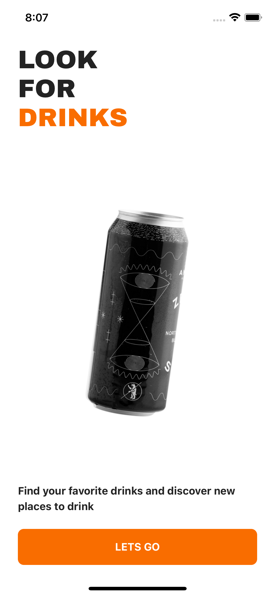
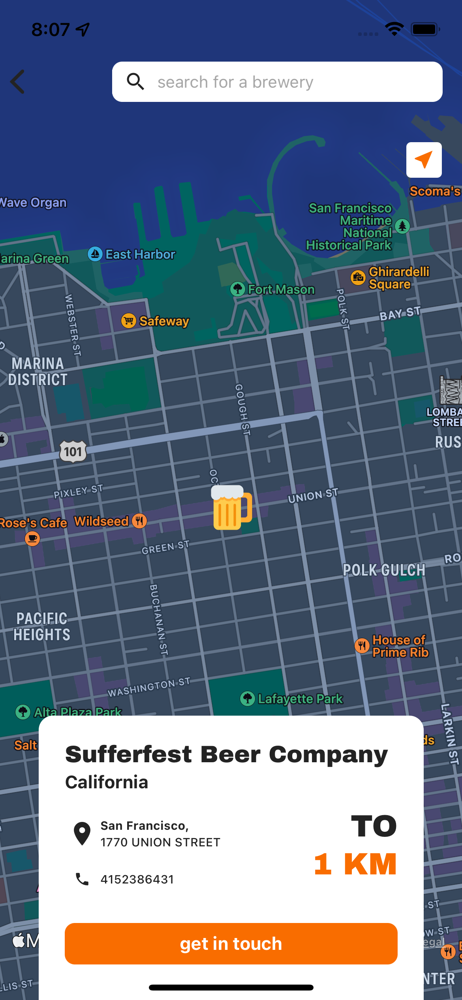
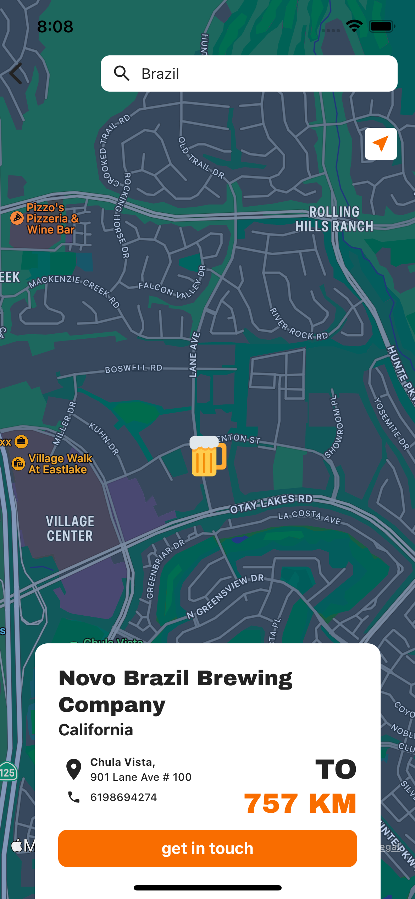

<h1 align="flex-start">
  Look For Drinks
</h1>
  <p align="flex-start">
    <a href="https://github.com/marlonbelomarques/lookfordrinks">
      
    </a>
  </p>
  <p>
    <a href="https://github.com/MarlonBeloMarques">
    
    </a>
  </p>


See the main bars and breweries near you, otherwise you can also search.

----

<p align="flex-start">
    
    
    
    
</p>

----

> This README will cover a little about the main tools used as well as running LookForDrinks locally.

- Assets
- Services
- Components
- Api
- Navigation
- Stores
- Themes
- Types
- Utils 

> Some of the main libraries used: Analytics e Crashlytics (Firebase), Async Storage, Mobx, Styled-Components, Reanimated, Axios, Formik, Yup, 
Size matters, React Native Config for environment variables, Integration with CodePush and Fastlane, Tests with Detox, Jest and React Native Testing Library etc.

### Prerequisites

If you have no idea how to install React Native and run it locally, check this out ***[getting started guide](https://archive.reactnative.dev/docs/getting-started)***.

If you want to rename the template according to your project, I recommend using ***[React Native Rename](https://github.com/junedomingo/react-native-rename)***.

Also, the project has firebase and codepush dependencies, in case you have no idea where to start, then check below:

- **Firebase**

   The project uses Analytics and Crashlytics, you will need to create an account on [firebase](https://console.firebase.google.com/) and create a project. don't forget to configure for Android and IOS, any doubts, check this [Getting started](https://firebase.google.com/?hl=pt-br), and for specific settings for React Native, follow through this [ guide](https://rnfirebase.io/).
    
- **CodePush**

   To set up CodePush, you will need to create an appcenter account and configure your environment. To help you, you can follow this ***[Guide](https://medium.com/reactbrasil/react-native-codepush-update%C3%A7%C3%B5es-r%C3%A1pidas-sem-bureaucracy-1a880490aabc)***.
   
- **Fastlane**

  To make the publishing and releasing process easier, you will need to set up your environment, please check ***[these steps](https://www.cloudbees.com/blog/react-native-developer-series-ios-and-android-fastlane-setup-and-certificates)***.
  
### Configuration

If you have configured firebase and codepush then you will only need to add some files and variables to the template.

- **Android**
  
  >Browse to the root of the project, then browse to the **android** folder, inside the **app** folder add the **google-services.json** file.
 
  >Add your codepush key to *CODE_PUSH_KEY_ANDROID* in **.env.dev** and **.env.prod** files.

- **IOS**
  
  >Browse to the root of the project, then browse to the **ios** folder, add the **GoogleService-Info.plist** file. It is important to carry out this process through **xcode**.
 
  >Add your codepush key in *CODE_PUSH_KEY_IOS* in **.env.dev** and **.env.prod** files.

### Build

Now the grand finale, at the root of the project, run:

```bash
yarn
```

Then, depending on the platform you want to run the template on, just run:

```bash
yarn android
```
```bash
yarn ios
```

### Distribution

If you want to distribute your app to stores, there are a few ways (*don't forget to have the environment set up*):

#### Fastlane
```
yarn fastlane:ios:release
```
```
yarn fastlane:ios:beta
```

#### Codepush
```
appcenter codepush release-react -t "1.0.0" -d Development
```
```
appcenter codepush release-react -t "1.0.0" -d Production
```

### Attention

The other scripts, such as unit tests, e2e test etc. You can find it at **package.json**.

## Contact

You still have any doubts, or need to talk to me, you can find me here:

- Instagram: [@marlonbelomarques](https://www.instagram.com/marlonbelomarques)
- Linkedin: [Marlon Marques](https://www.linkedin.com/in/marlon-marques-0b509813b/)
